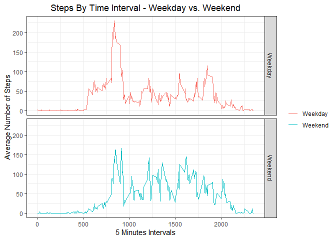

### Attach packages needed in the project

```r
library(ggplot2)
library(dplyr)
```


### Loading and preprocessing the data

```r
unzip('activity.zip')
activity <- read.csv("./activity.csv")
activity$date <- as.Date(activity$date)
```


### What is mean total number of steps taken per day?

##### 1. Calculate the total number of steps taken per day

```r
steps_data <- activity %>% select(date, steps) %>% group_by(date) %>% summarize(StepsPerDay= sum(steps, na.rm = TRUE))
head(steps_data,10)
```

```
## # A tibble: 10 x 2
##    date       StepsPerDay
##    <date>           <int>
##  1 2012-10-01           0
##  2 2012-10-02         126
##  3 2012-10-03       11352
##  4 2012-10-04       12116
##  5 2012-10-05       13294
##  6 2012-10-06       15420
##  7 2012-10-07       11015
##  8 2012-10-08           0
##  9 2012-10-09       12811
## 10 2012-10-10        9900
```

##### 2. Make a histogram of the total number of steps taken each day

```r
hist(steps_data$StepsPerDay, xlab = "Number of steps",main="Histogram of Total Steps taken per day", breaks = 10)
```

<!-- -->

##### 3. Calculate and report the mean and median of the total number of steps taken per day

```r
StepsPerDayMean <- mean(steps_data$StepsPerDay)
StepsPerDayMedian <- median(steps_data$StepsPerDay)
```
* Mean: 9354.2295082 
* Median: 10395


## What is the average daily activity pattern?
##### 1. The time series plot

```r
interval_data <- activity %>% select(interval, steps) %>% group_by(interval) %>% summarize(AverageSteps = mean(steps, na.rm = TRUE))

ggplot(interval_data, aes(x=interval, y=AverageSteps)) + 
  geom_line() +
  labs(title="Steps By Time Interval", x="5 Minutes Intervals", y="Average Number of Steps") +
  theme_bw() +
  theme(plot.title = element_text(hjust = 0.5))
```

<!-- -->

##### 2. Which 5-minute interval, on average across all the days in the dataset, contains the maximum number of steps?


```r
IntAvg <- round(max(interval_data$AverageSteps),4)
int <- interval_data$interval[which.max(interval_data$AverageSteps)]
```

* Interval 835 contains the maximum number of steps with the average of 206.1698 steps.


### Imputing missing values

##### 1. Calculate and report the total number of missing values in the dataset

```r
NACounts <- sum(is.na(activity$steps))
```

* Number of missing values: 2304

##### 2. Devise a strategy for filling in all of the missing values in the dataset.
I will use the mean for that 5-minute interval to impute the missing values. 

##### 3. Create a new dataset that is equal to the original dataset but with the missing data filled in.

```r
activityImputed <- activity %>% 
  group_by(interval) %>% 
  mutate(steps=ifelse(is.na(steps),mean(steps,na.rm=TRUE),steps)) %>% ungroup()
```


##### 4. Make a histogram of the total number of steps taken each day and Calculate and report the mean and median total number of steps taken per day.

```r
steps_data_imputed <- activityImputed %>% select(date, steps) %>% group_by(date) %>% summarize(StepsPerDay= sum(steps, na.rm = TRUE))
head(steps_data_imputed)
```

```
## # A tibble: 6 x 2
##   date       StepsPerDay
##   <date>           <dbl>
## 1 2012-10-01      10766.
## 2 2012-10-02        126 
## 3 2012-10-03      11352 
## 4 2012-10-04      12116 
## 5 2012-10-05      13294 
## 6 2012-10-06      15420
```


```r
hist(steps_data_imputed$StepsPerDay, xlab = "Number of steps",main="Histogram of Total Steps taken per day (Imputed)", breaks = 10)
```

<!-- -->


```r
StepsPerDayMeanImputed <- mean(steps_data_imputed$StepsPerDay)
StepsPerDayMedianImputed <- median(steps_data_imputed$StepsPerDay)
```
* Mean: 1.0766189\times 10^{4} 
* Median: 1.0766189\times 10^{4}

### Are there differences in activity patterns between weekdays and weekends?

##### 1. Create a new factor variable in the dataset with two levels – “weekday” and “weekend” indicating whether a given date is a weekday or weekend day.

```r
activityImputed$weekday <- weekdays(activityImputed$date)
activityImputed$dayType <- ifelse(activityImputed$weekday=="Saturday" | activityImputed$weekday=="Sunday", "Weekend", "Weekday" )
```

##### 2. Make a panel plot containing a time series plot

```r
AggActivity <- aggregate(steps ~ interval + dayType, data=activityImputed, mean)

ggplot(AggActivity, aes(x=interval, y=steps, color=dayType)) + 
  geom_line() + 
  facet_grid(dayType ~ .) +
  labs(title="Steps By Time Interval - Weekday vs. Weekend", x="5 Minutes Intervals", y="Average Number of Steps") +
  theme_bw() +
  theme(plot.title = element_text(hjust = 0.5),
        legend.title = element_blank())
```

<!-- -->
<br/> From the plot we can see the average steps fluctuate less on weekends while on weekdays there is a large spike in the morning. This is reasonable since most people commute on weekdays and don't need to go to work on the weekend.
